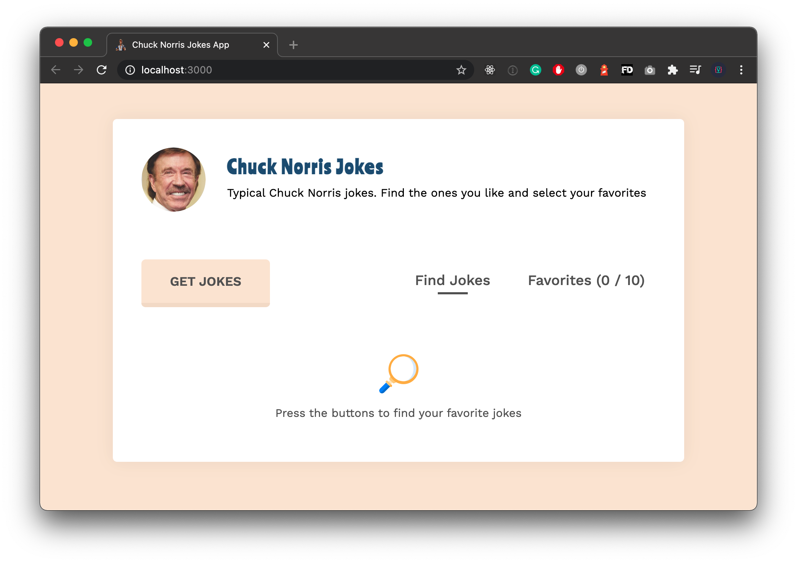

# Chuck Norris Jokes App



A first tryout with Vue.js. I never have worked on a project of my own with this framework. But I applied the knowledge I gained from the complete Vue [course](https://www.udemy.com/course/vuejs-2-the-complete-guide/) from Maximilian Schwarzmüller.

## Demo

Demo can be found here [https://valentijnkap.github.io/chuck-norris-jokes-app/](https://valentijnkap.github.io/chuck-norris-jokes-app/)

## Things to improve

- [ ] Break down the code into components for maintainability

## Running locally

Install packages and run

```sh
npm run watch
```
